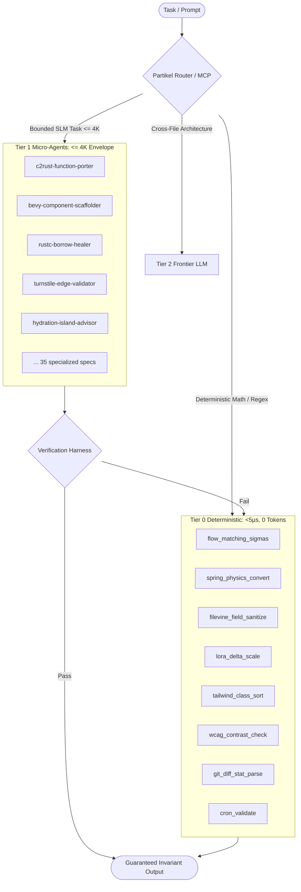

# Partikel (`ptk`)

> Sub-atomic micro-agent runtime, native Tier 0 deterministic tool engine, and Model Context Protocol (MCP) server.

[](https://www.rust-lang.org)
[](LICENSE)
[](https://modelcontextprotocol.io)

`partikel` (aliased as `ptk`) solves the critical flaws of micro-agent systems:
1. **Tier 0 Deterministic Execution**: Pure math, regex, and AST sorting run in native Rust in **nanoseconds with 0 token cost** rather than burning expensive LLM inference cycles.
2. **Strict 4K Token Ceiling**: Every micro-agent specification strictly fits inside a 4,000 token context envelope ($< 500$ tokens on average).
3. **Structured Output Contracts**: Predictable JSON / AST payloads with schema enforcement.
4. **Automated Verification Harness**: Verification rules and automated fallback escalation.
5. **Zero-Hop MCP Server**: Built-in JSON-RPC 2.0 stdio Model Context Protocol server exposing Tier 0 tools and micro-agents directly to orchestrators (Claude Code, Antigravity, Cursor, Zed).

---

## Architecture: The 5 Pillars



---

## Installation

```bash
git clone https://github.com/bhubbard/partikel.git
cd partikel
cargo install --path .
```

Both `partikel` and the short alias `ptk` will be installed to your Cargo binary path (e.g. `~/.cargo/bin`).

---

## CLI Usage

### 1. Tier 0 Deterministic Operations (0 tokens, sub-microsecond)

```bash
# Calculate flow-matching discrete sigma schedules (Wan2.1, LTX-2, FLUX, SD3)
ptk tier0 sigmas --steps 8 --shift 3.0

# Calculate Apple fluid spring physics constants and CSS cubic-bezier curves
ptk tier0 spring --response 0.35 --damping 0.7

# Sanitize arbitrary text into Filevine camelCase field selectors
ptk tier0 filevine "Incident Report / Police Log #"

# Calculate LoRA delta scaling factor (alpha / rank)
ptk tier0 lora --rank 16 --alpha 32.0

# Deterministic box-model CSS cascade class sorter
ptk tier0 tailwind "hover:bg-blue-600 rounded p-4 text-white flex"

# Check WCAG 2.2 AA and AAA contrast ratio and conformance
ptk tier0 wcag --fg "#1e40af" --bg "#ffffff"

# Validate standard 5-field cron schedules
ptk tier0 cron "*/15 * * * *"

# Parse git diff stats into typed file metrics
git diff --stat | ptk tier0 git-stat
```

### 2. Catalog Inspection & Statistics

```bash
# Show catalog summary and 4K ceiling compliance
ptk catalog stats

# List all 35 micro-agents with token estimates and Tier 0 mappings
ptk catalog list

# Filter agents by domain
ptk catalog list --domain rust

# Inspect full specification, prompt, and output contract
ptk catalog get rustc-borrow-healer
```

### 3. Automated Catalog Evaluation

```bash
ptk eval
```

Runs the 4K envelope verification on all 35 micro-agent markdown specifications:
```text
══════════════════════════════════════════════════════════
           PARTIKEL MICRO-AGENT EVALUATION HARNESS        
══════════════════════════════════════════════════════════
 • accessible-alt-text                  PASS [<=4K]   404 tokens 
 • ast-refactor-transformer             PASS [<=4K]   325 tokens 
 • astro-schema-ld-scaffolder           PASS [<=4K]   505 tokens 
 • bevy-component-scaffolder            PASS [<=4K]   429 tokens 
 • c2rust-crate-mapper                  PASS [<=4K]   466 tokens 
 • c2rust-function-porter               PASS [<=4K]   529 tokens 
 • ...
All micro-agents adhere to the 4K context token ceiling!
```

---

## MCP Server Configuration

`partikel` includes a native JSON-RPC 2.0 stdio Model Context Protocol (MCP) server.

Add `partikel` to your MCP client configuration:

### Antigravity (`~/.gemini/antigravity/mcp_config.json`)
```json
{
  "mcpServers": {
    "partikel": {
      "command": "ptk",
      "args": ["mcp"]
    }
  }
}
```

### Claude Desktop / Claude Code (`claude_desktop_config.json`)
```json
{
  "mcpServers": {
    "partikel": {
      "command": "/Users/bhubbard/.cargo/bin/ptk",
      "args": ["mcp"]
    }
  }
}
```

### Exposed MCP Tools:
- `tier0_sigmas`: Compute shifted discrete sigma schedule.
- `tier0_spring`: Compute Apple fluid spring physics constants and CSS.
- `tier0_filevine`: Sanitize field labels into Filevine camelCase.
- `tier0_lora`: Compute exact LoRA delta scaling factor.
- `tier0_tailwind`: Deterministic box-model CSS cascade class sorter.
- `tier0_wcag`: WCAG 2.2 AA/AAA contrast checker & luminance analyzer.
- `tier0_git_stat`: Parse `git diff --stat` output into typed metrics.
- `tier0_cron`: Validate 5-field cron expression & explanation.
- `partikel_catalog_list`: Browse and search micro-agent specifications.
- `partikel_catalog_get`: Retrieve complete prompt and contracts for any agent.

---

## Catalog Directory (`catalog/`)

The repository includes 35 micro-agent specifications:
- **Diffusion & Flow Matching**: `flow-matching-sigma-calculator.md`, `lora-delta-calculator.md`, `comfyui-node-rewirer.md`, `cinematic-prompt-enhancer.md`
- **Rust Systems & C++ Porting**: `c2rust-function-porter.md`, `c2rust-type-scaffolder.md`, `c2rust-crate-mapper.md`, `c2rust-test-porter.md`, `cpp-oop-to-data-oriented.md`, `bevy-component-scaffolder.md`, `glam-transform-bridge.md`, `rustc-borrow-healer.md`, `rustc-error-burn-down.md`, `rust-compiler-healer.md`
- **Frontend & Motion**: `spring-physics-converter.md`, `hyperframes-motion-designer.md`, `tailwind-class-sorter.md`, `layout-shift-cls-healer.md`, `mobile-tap-safety-fixer.md`, `accessible-alt-text.md`, `hydration-island-advisor.md`
- **Edge & Cloudflare**: `cloudflare-d1-migration-maker.md`, `turnstile-edge-validator.md`, `wrangler-binding-auditor.md`
- **LegalTech CRM**: `filevine-custom-field-sanitizer.md`, `leaddocket-webhook-triage-parser.md`
- **Developer Utilities**: `conventional-committer.md`, `unit-test-synthesizer.md`, `schema-validator.md`, `natural-to-awk.md`, `ast-refactor-transformer.md`, `op-dotenv-injector.md`, `op-secret-reference-scrubber.md`, `astro-schema-ld-scaffolder.md`, `mlx-safetensors-key-mapper.md`

---

## Development & Testing

```bash
make check      # Run cargo check
make test       # Run all 10 native unit tests
make clippy     # Run clippy with strict -D warnings
make fmt        # Run cargo fmt
make install    # Install local binary
```

## License

MIT
